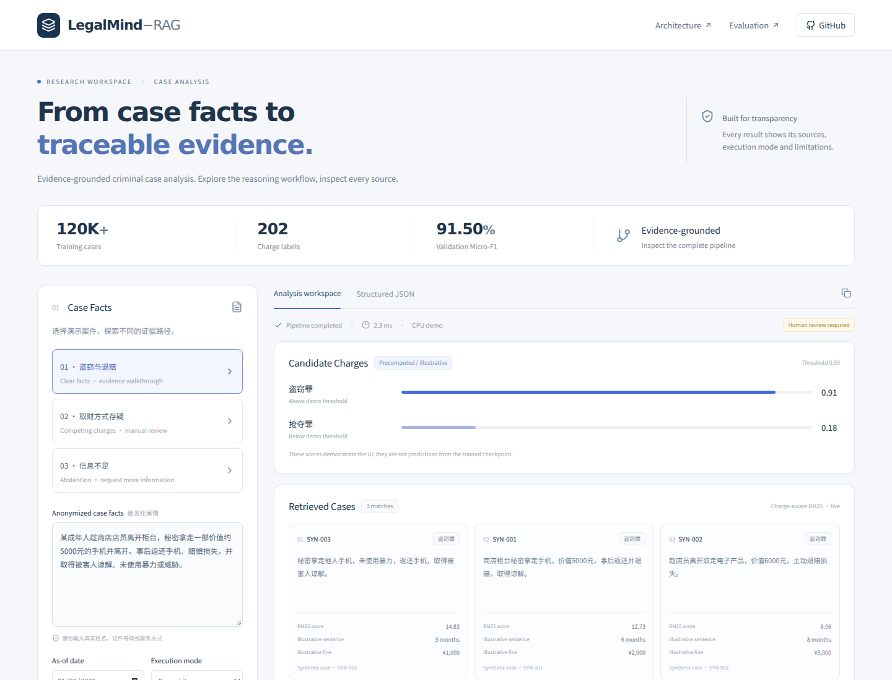
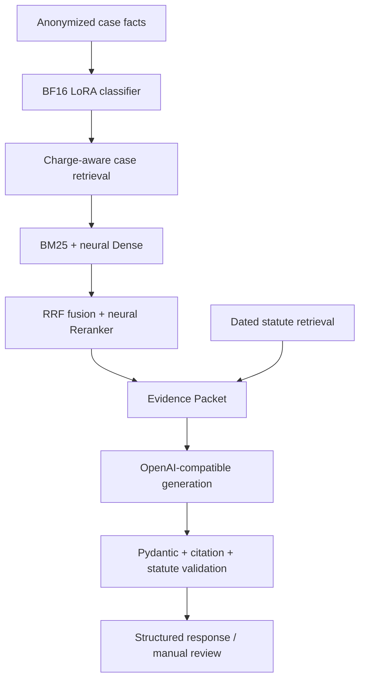

# LegalMind-RAG

**Evidence-Grounded Criminal Case Analysis with Qwen3-4B LoRA, Hybrid Retrieval and Controlled LLM Generation**

A research prototype that turns anonymized case facts into candidate charges, traceable case evidence and a reviewable structured response. **Default retrieval: charge-aware BM25 + neural Dense → RRF → neural Reranker.**


[](https://github.com/zhuzhenxiang93-create/RAG/actions/workflows/ci.yml)



[Try the demo](#quick-start) · [Architecture](docs/architecture.md) · [Evaluation](docs/evaluation.md) · [Full Mode](docs/full-demo.md)

## Product at a glance

| Dimension | Product design |
|---|---|
| **User need** | Turn anonymized case facts into a reviewable first-pass analysis with traceable evidence, explicit uncertainty and clear manual-review boundaries. |
| **Core workflow** | Case facts → candidate charges → charge-aware case retrieval → statute evidence → Evidence Packet → structured generation → validation / manual review. |
| **Key product decision** | Separate evidence retrieval from generation, expose Evidence IDs, and fail closed when required support is missing. |
| **AI stack** | Qwen3-4B BF16 LoRA classifier, BM25 + neural Dense recall, RRF, neural Reranker and OpenAI-compatible grounded generation. |
| **Trust & safety** | Synthetic public demo cases, explicit evidence validation, abstention/manual review, privacy redaction and a clear research-only disclaimer. |

## Recruiter 3-minute tour

1. Open the Product Demo and compare the clear-facts, competing-charges and insufficient-facts scenarios.
2. Inspect Pipeline Trace to see how classification, constrained retrieval, evidence construction and validation interact.
3. Open Evaluation to see what has been measured, what is still pending, and which results are intentionally not presented as production/legal reliability.

## Why LegalMind-RAG?

Charge classification alone leaves the reviewer without supporting evidence. Free-form generation makes it difficult to inspect where a claim came from. This prototype connects domain classification, charge-constrained retrieval, explicit Evidence IDs and validation, while exposing uncertainty and missing information.

**For recruiters:** try the three scenarios, inspect Pipeline Trace, then open Evaluation. This takes about three minutes. The API Demo requires a configured Alibaba Cloud Bailian API key and endpoints. It needs no GPU, classifier checkpoint or private dataset. API calls consume your provider quota.

## Product Demo

- **Clear facts:** theft, restitution and a forgiveness statement; view synthetic case matches.
- **Competing charges:** theft / snatching / robbery; inspect candidate ambiguity and missing facts.
- **Insufficient facts:** see abstention and a request for more information.

The UI explicitly displays **Bailian API / precomputed classification**. Classification scores are manually authored illustrations, not checkpoint predictions. Retrieval calls `text-embedding-v4` and `qwen3-rerank`; generation calls `qwen-plus`. BM25 and RRF execute locally. Edited/free-text inputs do not inherit preset scores and require Full Mode for classifier inference.

**Verification status:** [Live Bailian validation on 2026-09-27](docs/bailian-live-validation.md) completed all three synthetic presets with valid output and zero final-run generation fallbacks. Two presets exercised the complete Hybrid chain; the insufficient-facts preset skipped retrieval. Earlier diagnostics exposed a case-as-law generation error, corrected through system-level evidence instructions. The 30-request regression and screenshots remain explicitly marked mock fixtures.

Demo statute summaries have a recorded official-source URL but have **not** been verified against a dated authoritative text. All Lite scenarios therefore withhold legal/sentencing conclusions and require review. This is a transparent walkthrough of the workflow, not a validated legal answer demo.

## What It Does

1. Full Mode loads the Qwen3-4B **BF16 LoRA** classifier to predict candidate charges.
2. Candidate charges constrain the case retrieval space.
3. Case and applicable statute evidence form an Evidence Packet.
4. A configurable OpenAI-compatible model generates structured analysis.
5. Pydantic, Evidence-ID membership, evidence types, statute metadata and privacy patterns are checked.
6. Failures or incomplete support produce abstention / manual review.

## Architecture



The API Demo replaces classification with preset fixtures; retrieval and generation use Bailian APIs. Full Mode uses the existing research pipeline; it requires external assets. See [runtime boundaries](docs/architecture.md).

## Quick Start

### API Demo with Docker

```bash
git clone https://github.com/zhuzhenxiang93-create/RAG.git LegalMind-RAG
cd LegalMind-RAG
cp .env.example .env
# Fill DASHSCOPE_API_KEY, DASHSCOPE_BASE_URL and DASHSCOPE_RERANK_URL in .env.
docker compose up --build
```

Open **http://localhost:8080**. Docker configuration is supplied; container startup was not executed in the build environment because Docker was unavailable. The backend, frontend build and mock-provider browser flow are tested separately.

### Native development

Python 3.10+ and Node 22+:

```bash
python -m venv .venv
source .venv/bin/activate
python -m pip install -e '.[demo-hybrid]'
cp .env.example .env
# Configure the three required Bailian values in backend .env.
uvicorn legalmind.demo.api:app --host 127.0.0.1 --port 8000
```

In a second terminal:

```bash
cd app/frontend
npm ci
npm run dev -- --host 127.0.0.1
```

Open **http://localhost:5173**. The development server proxies `/api` to the backend. A terminal-only walkthrough also works:

```bash
python -m legalmind.demo --case clear-theft --as-of-date 2026-01-01
```

## Example Input / Output

Input: a manually constructed account of an adult secretly taking a shop's phone, later returning it, compensating the loss and obtaining a forgiveness statement.

Output includes candidate charge fixture scores, three synthetic Hybrid matches, unverified article summaries, cited Evidence IDs, a six-stage trace and a clear manual-review decision. Inspect the [mock contract output](demo/expected_outputs/clear-theft.json). Historical sentences and fines in Lite are invented interface examples; the system does not recommend them for the input case.

## Charge Classification

**Qwen3-4B + BF16 LoRA**, 202-label multi-label classification with `BCEWithLogitsLoss`.

| Training configuration | Value |
|---|---:|
| Training cases | 120,468 |
| Epochs / micro batch / gradient accumulation | 2 / 8 / 4 |
| Effective batch / optimizer updates | 32 / 7,530 |
| Best checkpoint | checkpoint-7500 |
| Max tokens / truncation | 2,048 / Head-Tail |
| LoRA r / alpha / dropout | 16 / 32 / 0.05 |
| Target modules / saved head | all-linear / score |
| Trainable parameters | ≈33,547,264 (≈0.827%) |
| Peak GPU memory | ≈15.95 GiB |

Dynamic padding, token-length bucketing and gradient checkpointing are implemented. Training/results above are the project owner's supplied run record; weights and the complete BF16 evaluation artifact are not redistributed here. Historical QLoRA experiments remain in the research archive and are not the current classifier.

## Retrieval

**Default in Demo and Full Mode:** hard charge filtering → BM25 + neural Dense → RRF (k=60) → neural cross-encoder Reranker → up to three deduplicated cases. Missing Hybrid components produce an explicit error; sparse fallback is disabled in the default configurations.

| Stage | Default implementation |
|---|---|
| Sparse recall | Local BM25, Chinese character bigrams |
| Dense recall | Bailian `text-embedding-v4`, 1,024 dimensions |
| Fusion | Local RRF, k=60 |
| Reranking | Bailian `qwen3-rerank` |
| Grounded generation | Bailian `qwen-plus` |

Both recall branches apply the same charge filter. The UI displays all four rankings and distinct scores. Missing configuration or retrieval failures return an explicit error without sparse fallback. Six synthetic records illustrate the pipeline; their invented sentences and fines are not predictions.

See [Bailian configuration and interface contracts](docs/hybrid-demo.md). The Embedding/Chat base URL and full Reranker URL are configured separately, using endpoints from the same regional console. Full Mode requires a prebuilt index made with the matching embedding model and dimensions.

## Grounded Generation

The API Demo and Full Mode build an Evidence Packet and call `qwen-plus` with JSON output and thinking disabled. Configure `GENERATION_MODEL` to change the compatible generation model. Credentials stay on the backend. Demo statute summaries are excluded from generation evidence because they are unverified; legal conclusions must therefore be withheld.

Invalid output gets at most one repair. Provider errors or repeated validation failures return an explicit low-confidence fallback, visibly labelled `fallback`. Historical [generation SFT](docs/experiments/generation-sft.md) is outside the default pipeline. The traditional sentencing model remains disabled by default.

## Safety & Reliability

- Strict Pydantic schema and evidence membership/type checks.
- Official-source domain and recorded verification-status checks; applicability uses supplied effective/expiry dates.
- Missing verified legal support blocks an `analyzed` generation result.
- Pattern-based privacy redaction; this is not comprehensive anonymization.
- Candidate probabilities are not legal certainty; thresholds require matching validation calibration.
- Citation validation checks provenance and structure, **not semantic entailment or legal correctness**.

## Evaluation

| Metric | **Validation** result |
|---|---:|
| Micro-F1 | 0.9150 |
| Macro-F1 | 0.8394 |
| Micro Precision | 0.9311 |
| Micro Recall | 0.8995 |
| Hamming Loss | 0.001027 |

**Independent BF16 test evaluation pending corrected evaluator run.** No corrected independent BF16 test artifact was found in the audited branches. Do not present these Validation numbers as Test results.

The [30-request mock API contract regression](demo/evaluation/results.json) checks schema, citations and fail-closed behavior. It is **not a human-reviewed legal benchmark**. All requests are expected to abstain; review selectivity and useful legal answering are not measured. See [evaluation scope and results](docs/evaluation.md).

## Current vs Experimental

| Component | Status |
|---|---|
| Qwen3-4B BF16 LoRA | Implemented; external checkpoint required |
| Charge-aware BM25 + Dense | Default; Bailian API; two live Hybrid presets validated |
| RRF / neural Reranker | Default; live synthetic presets + mock HTTP tests |
| Statute retrieval and temporal filters | Implemented; verified source metadata required |
| Evidence Packet / OpenAI-compatible generation | Three live synthetic presets validated |
| Pydantic / Evidence-ID whitelist | Implemented and regression-tested |
| Recruiting Web UI / Lite | Implemented and browser-tested |
| Generation SFT | Historical / experimental |
| Traditional sentencing model | Research baseline, disabled by default |
| Long-text sliding window | Planned |
| Human-reviewed legal benchmark | Planned |

## Repository Structure

```text
app/                    Frontend and backend container definitions
src/legalmind/demo/     Lite service, FastAPI and strict Full Mode adapter
src/legalmind/          Classification, retrieval, generation, data and baseline modules
demo/                   Synthetic cases, expected outputs, screenshots and evaluation
configs/                Strict Hybrid defaults and research configurations
docs/                   Architecture, evaluation, full reproduction and historical notes
scripts/                Training, indexing and evaluation entry points
tests/                  Component, contract and demo regression tests
.github/workflows/      Python and frontend CI
```

## Full Reproduction

Use [Full Mode setup](docs/full-demo.md) for the matching base model, adapter, label mapping, calibrated thresholds, case index, statute index and API configuration.

```bash
legalmind analyze --fact "匿名化案件事实……" --as-of-date 2026-01-01
```

Full Mode fails explicitly if required assets are absent. API Demo needs the Bailian configuration but no classifier assets.

## Data Governance & Limitations

**Training data is not redistributed by this repository.** The inherited CAIL-derived source is recorded as `legacy_local_file_unverified`; the source/license chain needs verification before redistribution or adapter release. Full model artifacts are not redistributed. Public demo cases are authored synthetic fixtures.

The prototype is not deployed as a public production service. It lacks a human-reviewed legal benchmark, demonstrated legal-answer reliability, broad privacy guarantees and hosted GPU inference. The demo is intentionally conservative about statute provenance. Old documents under `reports/` and research notes describe historical runs; this README and the release audit define the recruiting release.

## Roadmap

- Re-run and publish corrected independent BF16 test artifacts.
- Verify dated statute snapshots and evaluate useful answers as well as abstention.
- Evaluate Hybrid versus BM25 on human-reviewed relevance judgments.
- Add long-text sliding-window inference and calibrated review thresholds.

## Disclaimer

**Research / decision-support prototype, not legal advice.** Outputs do not constitute judicial decisions, sentencing recommendations or professional legal advice.
