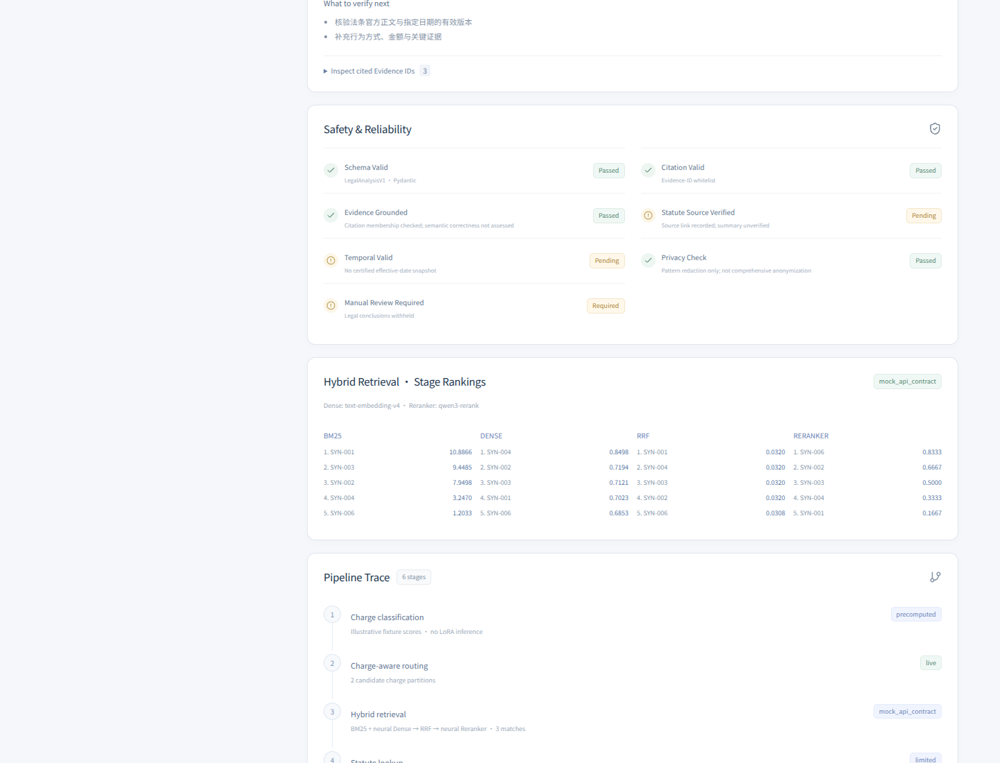

# Bailian Hybrid retrieval

Default: candidate charges → filter both recall branches → BM25 + Dense → RRF (k=60) → API Reranker → up to three deduplicated cases → Qwen-Plus.

## Configuration

Copy `.env.example` to `.env` in the repository root. The backend loads it without overriding existing environment variables. Restart the backend after changes. The frontend receives no key.

| Variable | Meaning / default |
|---|---|
| `DASHSCOPE_API_KEY` | Required backend credential |
| `DASHSCOPE_BASE_URL` | Required OpenAI-compatible base URL for Embedding and Chat |
| `DASHSCOPE_RERANK_URL` | Required complete `qwen3-rerank` URL |
| `DASHSCOPE_EMBEDDING_MODEL` | `text-embedding-v4` |
| `DASHSCOPE_EMBEDDING_DIMENSIONS` | `1024`; must match stored vectors |
| `DASHSCOPE_RERANK_MODEL` | `qwen3-rerank`; this adapter implements its flat contract |
| `GENERATION_MODEL` | `qwen-plus` |

Copy exact endpoints from your regional Bailian console. A workspace endpoint may look like `https://<workspace-id>.cn-beijing.maas.aliyuncs.com/compatible-mode/v1`; its reranker endpoint uses `/compatible-api/v1/reranks`. Replace the host with your actual workspace endpoint. Do not mix regions, paste placeholders, or infer the reranker URL by appending `/rerank` to the chat URL. Other rerank model families can use different request formats and need separate adapters.

References: [Embedding compatibility](https://help.aliyun.com/zh/model-studio/embedding-interfaces-compatible-with-openai), [Rerank API](https://help.aliyun.com/zh/model-studio/text-rerank-api).

## Requests

Embedding uses the OpenAI SDK with `model`, `input`, `dimensions`, and `encoding_format=float`. `text-embedding-v4` requests are capped at ten texts per batch, including when loading older index metadata. Returned indexes are checked and reordered; vectors are normalized. Demo corpus embeddings are cached once per process/configuration. Each supported query calls Embedding and Reranker again.

Reranker sends the flat JSON fields `model`, `query`, `documents`, `top_n`, `instruct`; it reads top-level `results` with `index` and `relevance_score`. Duplicate/out-of-range indexes, incomplete results and nonfinite scores are rejected. Provider scores remain distinct from BM25, cosine and RRF scores.

Chat uses `qwen-plus`, `enable_thinking=false` and `response_format={"type":"json_object"}`. The Evidence Packet contains only allowed evidence. Schema and citation checks run after generation, with one repair at most. Generation failures are labelled fallback; retrieval failures return HTTP 503 without BM25-only substitution.



## Verification boundary

Live validation of the three synthetic presets is recorded in [the 2026-09-27 report](bailian-live-validation.md). Offline tests use `httpx.MockTransport` around the real OpenAI SDK and HTTP reranker client. BM25, vector search, filtering, RRF, response-index mapping and output validation execute normally over synthetic data. Mock vectors and generated text do not measure model quality or live service compatibility.

```bash
python scripts/evaluate_demo.py --mock-provider  # offline, no provider charge
python scripts/evaluate_demo.py                  # live calls using .env; consumes quota
```

The live command writes separate `live-results.json` / `live-outputs.jsonl` files locally, never overwriting checked-in mock fixtures. Inspect `generation_fallback_count` as well as schema rates: a safe fallback is not a successful model generation. API Demo classification is still illustrative; arbitrary input needs Full Mode.
